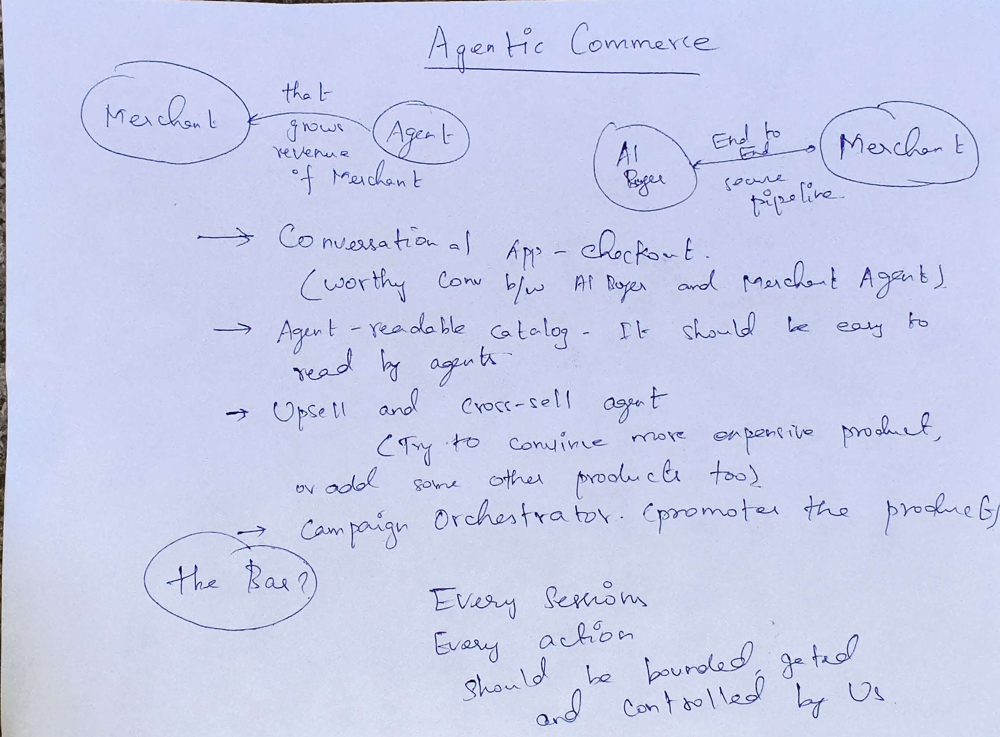
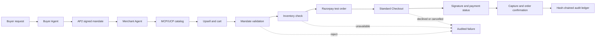

# Agentic Commerce Platform

This is my prototype for an AI buyer and a merchant agent working together. I started with a simple question: can a buyer agent find a product, negotiate an upsell, and complete a purchase without giving the agent unlimited control over money?

The answer needs more than a chat window. The merchant has to expose products in a way an agent can read, the buyer needs a clear spending limit, and every important decision needs to be visible after the transaction.



## What I Built

There are two agents in the project:

- The **Buyer Agent** understands the request, creates a bounded AP2 mandate, searches the merchant catalog, and evaluates an upsell.
- The **Merchant Agent** exposes the catalog through MCP and UCP, communicates through A2A, checks the mandate, creates a Razorpay test order, and records the result.

The original idea also included a campaign orchestrator. I kept the first working version focused on the part that is easiest to demonstrate honestly: agent-readable discovery, upselling, and a guarded checkout.


## How I Approached It

I broke the flow into small decisions instead of letting one model call do everything:

1. Discover a product from the buyer's request.
2. Recommend an add-on only when it fits the spending limit.
3. Sign and validate an AP2 mandate.
4. Check stock before sending anything to Razorpay.
5. Use Razorpay Standard Checkout for real test-mode authorization.
6. Confirm the order only after the payment is verified and captured.
7. Write the decisions and failures to a hash-chained DynamoDB ledger.


## What I Fixed During Development

The first version looked good on the happy path, but testing exposed three problems:

- The audit record was changed after its hash was calculated.
- A stock failure could happen after payment.
- A Razorpay API error could look like a successful simulated payment.

I fixed those at the control points. The ledger now hashes the final event, inventory is checked before order creation, and live Razorpay errors fail closed. The checkout path uses Razorpay's supported browser flow, verifies the returned signature, checks the payment status, and only then updates stock and confirms the order.


## Architecture After the Fix



The important rule is simple: a failed check stops the flow. The system does not invent a payment, and it does not report an order as complete just because an order ID exists.

The test suite covers the offline flow. With `RAZORPAY_MODE=test` and Razorpay test keys configured, the server creates a real test order and opens Standard Checkout; the user completes the payment and the final order is confirmed only after server-side signature and captured-status verification.

## Payment and product-source modes

`RAZORPAY_MODE=mock` is the offline default and is the only mode that simulates settlement. Set `RAZORPAY_MODE=test` with valid test keys to open Razorpay Standard Checkout; the backend never submits a UPI ID or treats a browser success message as a confirmed payment.

Set `AMAZON_MCP_ENABLED=true` plus `AMAZON_MCP_URL` to use an authorised Amazon-product MCP server exposing `amazon_search_products`. Results are normalized and the backend still enforces availability and `price <= AP2 mandate budget`. With it disabled, the built-in mock product provider keeps the demo usable without credentials.

---

## ⚙️ Setup Guide

### Step 1 — Install Dependencies

```bash
pip install -r requirements.txt
```

### Step 2 — Get API Keys (Free)

#### AWS Bedrock (Required for real AI)

1. Choose an AWS region where the selected Bedrock model is enabled.
2. Grant the runtime `bedrock:Converse` permission for the model.
3. Configure credentials through the standard AWS credential chain.

#### Razorpay Test Keys (Required for real payments)

1. Go to **https://dashboard.razorpay.com**
2. Sign up free (no real money involved in test mode)
3. Go to **Settings → API Keys**
4. Click **"Generate Test Key"**
5. Copy **Key ID** (starts with `rzp_test_...`) and **Key Secret**

### Step 3 — Configure `.env`

Open `Razor_pay/.env` and fill in your keys:

```env
# AWS Bedrock — use the AWS credential chain (profile, environment, or IAM role)
AI_PROVIDER=bedrock
AWS_REGION=us-east-1
BEDROCK_MODEL_ID=amazon.nova-lite-v1:0
BEDROCK_EMBEDDING_MODEL_ID=amazon.titan-embed-text-v2:0
DYNAMODB_TABLE_NAME=acp-audit-ledger

# Razorpay Test Mode — get from dashboard.razorpay.com → Settings → API Keys
RAZORPAY_KEY_ID=rzp_test_xxxxxxxxxxxxxxxxxxxx
RAZORPAY_KEY_SECRET=your_secret_here

# Agent URLs (leave as-is for local development)
MERCHANT_AGENT_URL=http://localhost:8000
BUYER_AGENT_URL=http://localhost:8001

# AP2 Mandate crypto secret (change this in production)
AP2_MANDATE_SECRET=AP2_MANDATE_SECRET_AUTHORIZATION_KEY_2026
```

> **Without keys**: Everything still runs in demo/simulated mode. The UI shows a warning banner explaining which keys are missing. All protocol structures (A2A, MCP, AP2) are real — only Razorpay API calls and Bedrock AI reasoning are unavailable.

For Bedrock mode, grant the runtime `bedrock:Converse` permission for the selected model and configure AWS credentials with the standard AWS credential chain. The buyer health endpoint reports `ai_mode: "bedrock"` only when credentials are available; otherwise it reports `unavailable` and uses the deterministic fallback.

Create the DynamoDB table before starting the services. The table uses `pk` as
the partition key and `sk` as the sort key; users and audit events share this table.

From PowerShell, create the table once with the same AWS profile and region used
by the application:

```powershell
aws dynamodb create-table `
  --table-name acp-audit-ledger `
  --attribute-definitions AttributeName=pk,AttributeType=S AttributeName=sk,AttributeType=S `
  --key-schema AttributeName=pk,KeyType=HASH AttributeName=sk,KeyType=RANGE `
  --billing-mode PAY_PER_REQUEST `
  --region us-east-1 `
  --profile default

aws dynamodb wait table-exists `
  --table-name acp-audit-ledger `
  --region us-east-1 `
  --profile default
```

If the table already exists, `create-table` can be skipped. Verify access before
starting the application:

```powershell
aws sts get-caller-identity --profile default
aws dynamodb describe-table `
  --table-name acp-audit-ledger `
  --region us-east-1 `
  --profile default
```

The application uses `boto3`'s standard AWS credential chain, so it reads the
`default` profile configured by `aws configure`. `app/services/database_ledger.py`
persists audit records and `app/services/auth_service.py` persists users in this
same table. No SQLite database is used.

---

## 🚀 Quick Start

### Terminal 1 — Merchant Agent (port 8000)

```bash
cd Razor_pay
python main.py
```

Open: http://localhost:8000 | Swagger: http://localhost:8000/docs

### Terminal 2 — Buyer Agent (port 8001)

```bash
cd Razor_pay
python buyer_agent/main.py
```

Open: **http://localhost:8001** ← The buyer UI with split-screen interface

### Terminal 3 — Standalone MCP Server (optional, for external LLM clients)

```bash
cd Razor_pay
python mcp_server.py
```

### Run Tests

```bash
python -m pytest tests/ -v
# Expected: 28/28 passed
```

---

## 🔌 Protocol Endpoints

### Merchant Agent (port 8000)

| Endpoint                    | Method | Protocol           | Description                                               |
| :-------------------------- | :----- | :----------------- | :-------------------------------------------------------- |
| `/.well-known/agent.json` | GET    | **A2A**      | Real`a2a.types.AgentCard` protobuf                      |
| `/api/a2a/message`        | POST   | **A2A**      | Real`SendMessageRequest → Task → SendMessageResponse` |
| `/mcp`                    | POST   | **MCP**      | JSON-RPC 2.0:`tools/list`, `tools/call`               |
| `/api/mcp/tools`          | GET    | **MCP**      | `mcp.types.Tool[]` manifest                             |
| `/api/catalog`            | GET    | **UCP**      | Schema.org JSON-LD agent-readable catalog                 |
| `/api/commerce/stream`    | POST   | **REST+SSE** | Full pipeline with live streaming                         |
| `/api/commerce/run-flow`  | POST   | **REST**     | Synchronous pipeline                                      |
| `/api/audit/ledger`       | GET    | **REST**     | SHA-256 hash-chained audit trail                          |

### Buyer Agent (port 8001)

| Endpoint                      | Method | Description                       |
| :---------------------------- | :----- | :-------------------------------- |
| `/`                         | GET    | Split-screen buyer UI             |
| `/api/buyer/health`         | GET    | Key status + configuration check  |
| `/api/buyer/merchant/card`  | GET    | Fetches merchant's A2A AgentCard  |
| `/api/buyer/merchant/tools` | GET    | Fetches merchant's MCP tools      |
| `/api/buyer/run`            | GET    | SSE pipeline stream (EventSource) |
| `/api/buyer/a2a/send`       | POST   | Direct A2A message to merchant    |
| `/api/buyer/mcp/call`       | POST   | Direct MCP tool call              |

---

## 📚 Real Protocol Libraries Used

| Protocol     | Library          | Version    | Types Used                                                                                                     |
| :----------- | :--------------- | :--------- | :------------------------------------------------------------------------------------------------------------- |
| Google A2A   | `a2a-sdk`      | `1.1.2`  | `AgentCard`, `Message`, `Part`, `Task`, `TaskStatus`, `TaskState`, `SendMessageRequest/Response` |
| MCP          | `mcp`          | `1.26.0` | `Tool`, `ToolAnnotations`, `TextContent`, `CallToolResult`, `ListToolsResult`                        |
| Razorpay     | `razorpay`     | `2.0.1`  | Test-mode order creation, payment execution, HMAC-SHA256 verification; live API errors fail closed             |
| AWS AI       | `boto3`        | `>=1.35.0` | Amazon Bedrock Converse and Titan embeddings                                                        |
| AP2 Mandates | stdlib`hmac`   | —         | HMAC-SHA256 signed bounded spending mandates                                                                   |

---

## 🏆 Track 01 Bar Compliance

| Requirement                              | Implementation                                                                                                                                                |
| :--------------------------------------- | :------------------------------------------------------------------------------------------------------------------------------------------------------------ |
| **Grow merchant revenue**          | Dynamic upsell engine picks highest-margin add-on within AP2 mandate headroom                                                                                 |
| **Sellable to AI buyers**          | Real`AgentCard` + real MCP `Tool[]` + Schema.org UCP catalog                                                                                              |
| **Every money action explainable** | SHA-256 hash-chained DynamoDB audit ledger at`GET /api/audit/ledger`                                                                                         |
| **Bounded and gated**              | HMAC-SHA256 AP2 Mandate required for every payment — budget/merchant/expiry enforced                                                                         |
| **Audit trail shown**              | Full hash-chained event timeline with`integrity_verified: true`                                                                                             |
| **Failures handled gracefully**    | Tampered/expired/category-invalid mandate · Budget breach · Merchant offline · Out-of-stock checkout · Razorpay gateway failure · Missing keys/demo mode |
| **Razorpay test-mode APIs**        | `razorpay==2.0.1` SDK, real `client.order.create()`, HMAC verification                                                                                    |
| **Agent-to-agent commerce**        | Real A2A HTTP calls from buyer → merchant using`a2a-sdk` protobuf types                                                                                    |

---

## 📁 Project Structure

```
Razor_pay/
├── .env                          ← Your API keys (git-ignored)
├── .env.example                  ← Template — copy to .env
├── requirements.txt              ← Pinned production dependencies
├── main.py                       ← Merchant Agent (port 8000)
├── mcp_server.py                 ← Standalone FastMCP stdio server
├── buyer_agent/                  ← Buyer Agent (port 8001)
│   ├── main.py                   ← FastAPI entry point
│   ├── models.py                 ← BuyerIntent, PurchaseRequest
│   ├── static/index.html         ← Split-screen buyer UI
│   └── agent/
│       ├── buyer_core.py         ← Bedrock-powered pipeline orchestrator
│       ├── a2a_client.py         ← Real A2A HTTP client (a2a-sdk)
│       ├── mcp_client.py         ← Real MCP HTTP client (mcp.types)
│       └── ap2_mandate.py        ← Standalone HMAC-SHA256 mandate creation
├── app/
│   ├── config.py                 ← Pydantic-settings (loads .env)
│   ├── models.py                 ← Core Pydantic data models
│   ├── protocols/
│   │   ├── a2a.py                ← Real a2a-sdk AgentCard + message handler
│   │   ├── mcp_ucp.py            ← Real mcp.types Tool + CallToolResult
│   │   └── ap2_mandate.py        ← HMAC-SHA256 mandate engine
│   ├── merchant/
│   │   ├── catalog.py            ← Structured catalog search
│   │   └── upsell_engine.py      ← Revenue maximizer
│   └── services/
│       ├── embedding_service.py  ← Bedrock Titan embeddings + JSON cache
│       ├── razorpay_service.py   ← Real Razorpay SDK integration
│       ├── audit_ledger.py       ← SHA-256 hash-chain ledger
│       └── database_ledger.py    ← DynamoDB persistence
└── tests/                        ← 22 automated tests
```

